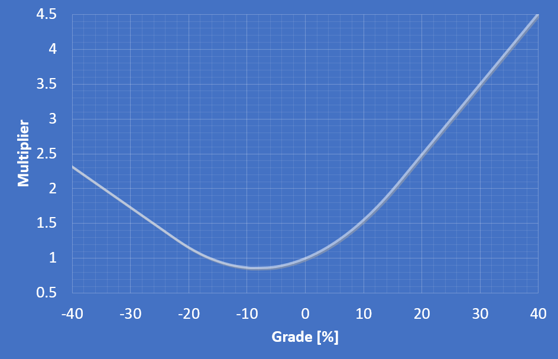
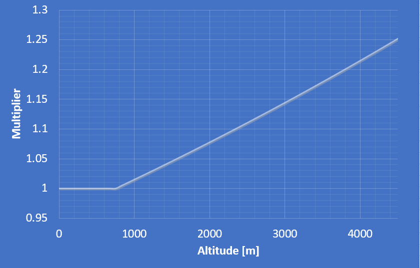
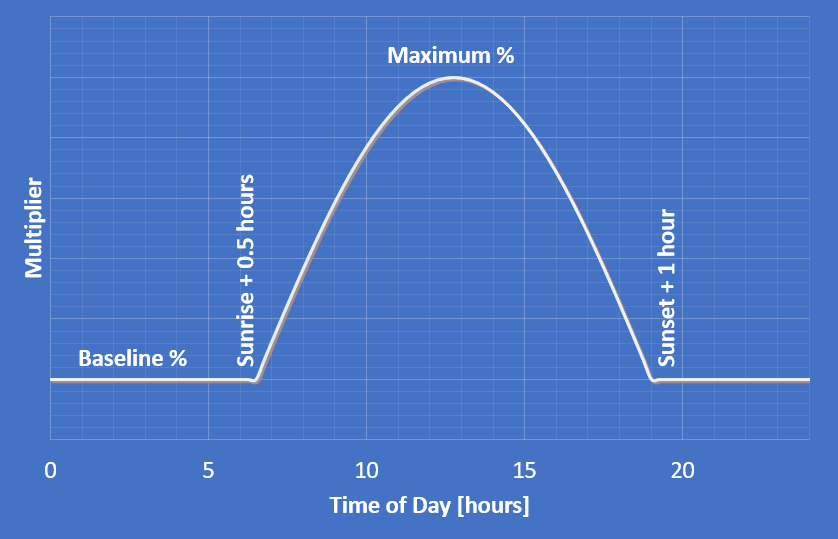

The models below are applied for pacing calculations.

- **Grade** is defined automatically by elevation data in the GPX track
- **Altitude** is defined automatically by elevation data in the GPX track
- **Terrain** is manually defined by setting Waypoint "Terrain Factors"
- **Heat** is optionally input for each Plan
- **Darkness** is calculated based on terrain and sunrise/sunset times
- **Strategy** is optionally input for each Plan

##### Grade

The grade model is shown below. Upgrades require more effort than
flat terrain. Downgrades require less effort, to a crossover point at about
-16%, where it starts to become more difficult again.\

##### Altitude

The altitude model is an exponentially increasing factor. The default model has
a lower threshold of 750 meters, under which altitude is assumed to be
insignificant. Above 750 meters, the time to run a given distance increases at
a rate of 6% every 1000 meters, compounded continuously.
Users can adjust their altitude acclimatization on the Settings page.\
This model is based on research from Jon Peter Wehrlin & Jostein Hallén [1], which indicates a 6.3% decrease in VO~2,max~ per 1000m.

##### Terrain

The terrain model is manually input by waypoint and is based on course
knowledge. It is intended to address anything that is too small to appear in
elevation data.
Terrain factors are defined by the course owner using the "Edit" buttons within
the "Waypoints" tab.
Typical value ranges by terrain type are:

- Paved: 0%
- Fireroad: 2-6%
- Doubletrack: 6-10%
- Singletrack: 10-20%
- Technical: 20-50% +

##### Heat

The heat model the top half of a sinusoidal curve. A "baseline" heat factor can
be applied outside of peak hours. The heat model activates 1/2 hour after
sunrise and returns to baseline 1 hour after sunset, peaking at a maximum value
as specified.
A heat model can be defined for each plan. If no heat model is defined, no heat
factor is used.\

##### Darkness

From dusk to dawn, a darkness factor equal to the terrain factor is applied
(essentially doubling the terrain factor).
During twilight hours (from dawn to sunrise and sunset to dusk), the darkness
factor is linearly applied between nothing (daytime) and the full darkness
factor.\
Users can personalize the affect of darkness on the Settings page.

##### Pacing Strategy

Pacing strategy is intentional/planned changes in level of effort through the
race. It can be linearly applied, reducing time per distance at the beginning
of the race and increasing at the end of the race, or by more advanced models.
Pacing strategy is defined by the user for each plan.\
Unless otherwise specified, defaults are applied as a linear
degradation throughout, to factor in
typical fatigue, applied based on the overall course/race distance:

- 30 km and under: 2%
- 30 - 60 km: 5%
- 60 to 90 km: 10%
- 90 to 120 km: 15%
- 120 km and over: 20%

See [Create/Modify Plans](/docs/plans) for more on modifying strategy.

#### Research/Improvement Opportunities

"All models are wrong, but some are useful." - George Box

Additional research can help to improve the models underpinning ultraPacer. Topics that could use better support are:

1. Influence of down-grades as a function of time/distance/fatigue (we all know that going downhill gets harder late in a long event, but this is not currently supported in the models.)
2. Separating influences of humidity, exposure, and temperature from the generic "heat" model.

If you know of existing research that could/should be incorporated into ultraPacer, please send it my way.

We are also able to provide (minimal) financial assistance for graduate students or professors who are interested in pursuing research that can further enhance ultraPacer's capabilities.

#### Citations
1. Wehrlin, J.P., Hallén, J. Linear decrease in and performance with increasing altitude in endurance athletes. Eur J Appl Physiol 96, 404–412 (2006). [https://doi.org/10.1007/s00421-005-0081-9](https://doi.org/10.1007/s00421-005-0081-9)
